# college-dbms-project

The project demonstrates the implementation of database concepts such as primary keys, foreign keys, relationships, joins, aggregate functions, grouping, subqueries, views, and data retrieval operations. It is designed to help understand how multiple entities in a college environment interact with each other through a structured relational database.

## Features

- Student Management
- Department Management
- Course Enrollment
- Faculty Records
- Hostel Allocation
- Result Processing

## SQL Concepts Used

- Primary Keys
- Foreign Keys
- Joins
- Group By
- Having
- Aggregate Functions
- Subqueries
- Views

## Tools Used

- MySQL
- MySQL Workbench
- GitHub

## Screenshots

### Display all female students.
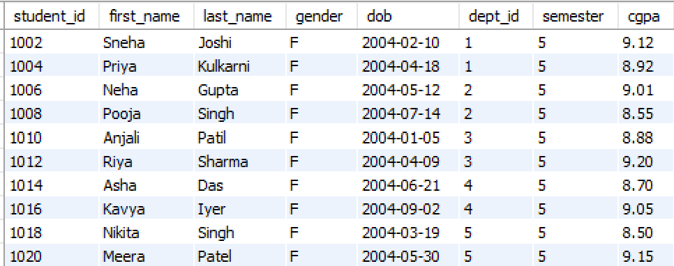

### Find the top 3 students with the highest CGPA.
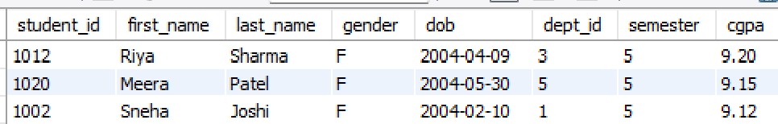

### Find the total number of students in the college.
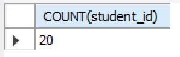

### Find the average CGPA of all students.
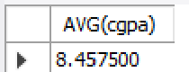

### Find the highest CGPA among all students.
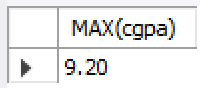

### Find the number of students in each department.
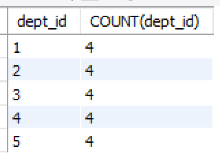

### Average CGPA department-wise
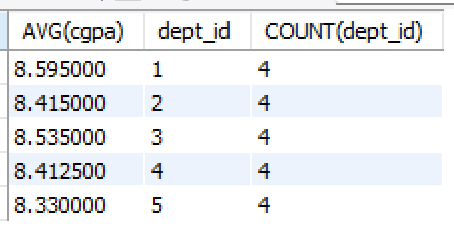

### Display: student_id,first_name,dept_name(JOIN)
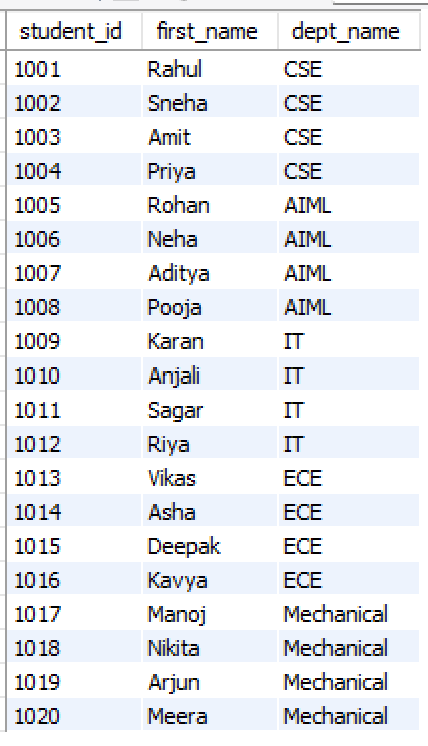

### Display: student_name,course_name,grade(JOIN)
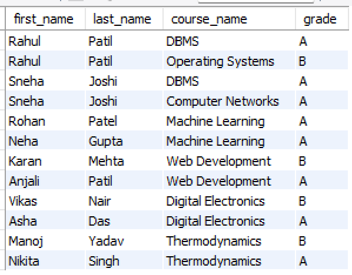

### Highest CGPA using a subquery(NESTED QUERY)
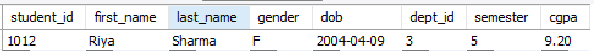

### Find the names of students whose CGPA is greater than the average CGPA of all students.
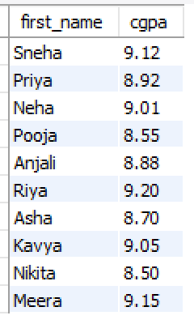

### Display student_id,student name,department name using VIEW.
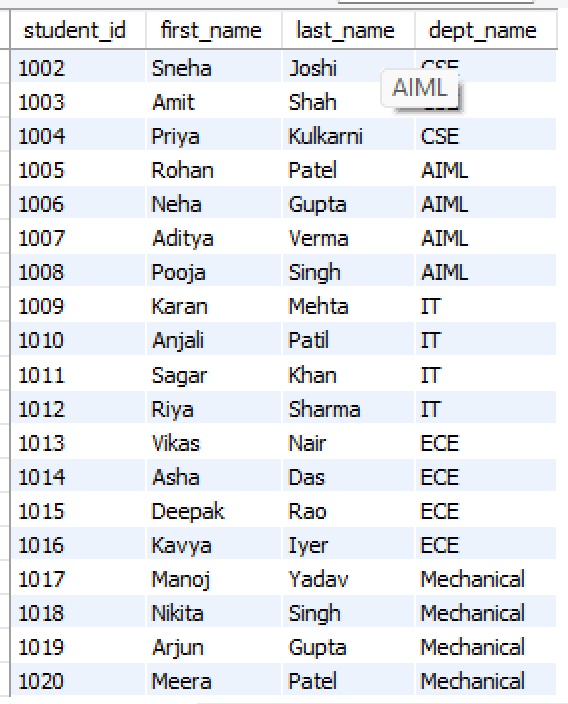
